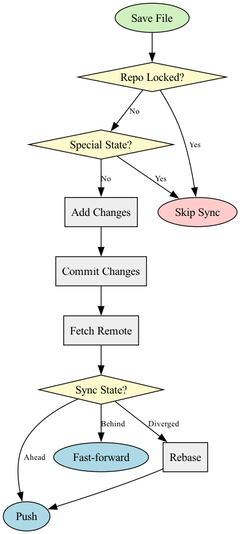

* Git Sync Mode

~git-sync-mode~ is a minor mode for Emacs that automatically syncs your git repositories after you save a file. It commits, fetches, and pushes your changes, keeping local and remote repositories in sync.

#+begin_quote
~git-sync-mode~ is inspired from [[https://github.com/simonthum/git-sync][git-sync]], it brings the set-it-and-forget-it peace of mind directly into your Emacs workflow.
#+end_quote

** Installation
#+begin_src elisp
(use-package git-sync-mode
  :vc (:url "https://github.com/justinbarclay/git-sync-mode" :rev :newest)
  :hook (after-init . git-sync-global-mode)
  :config
  (add-to-list 'git-sync-allow-list (expand-file-name "~/src/my-project")))
#+end_src

** Features

- *Automatic Syncing*: Automatically syncs your work after every save.
- *Customizable Commit Messages*: You can customize the commit message format.
- *Workspace Support*: You can specify which projects to enable ~git-sync-mode~ for.

** Usage

*** Global Mode

The easiest way to use ~git-sync-mode~ is to enable ~git-sync-global-mode~. This will automatically enable ~git-sync-mode~ for any file in a directory that is in the ~git-sync-allow-list~.

#+begin_src elisp
(git-sync-global-mode)
(add-to-list 'git-sync-allow-list (expand-file-name "~/src/my-project"))
#+end_src

*** Per-project with ~.dir-locals.el~

You can also enable ~git-sync-mode~ on a per-project basis using ~.dir-locals.el~. This is useful if you want to enable it for a specific project without adding it to your global allow list.

#+begin_src elisp
;;; Directory Local Variables            -*- no-byte-compile: t -*-
;;; For more information see (info "(emacs) Directory Variables")

((nil . ((mode . git-sync))))
#+end_src

** Customization

- ~git-sync-generate-message~: A function that is called to generate the commit message. It takes no arguments and is run in the context of the current buffer.

  #+begin_src elisp
  (defun my/commit-message ()
    (format "WIP: changes from %s on %s" (system-name) (current-time-string)))

  (setq git-sync-generate-message #'my/commit-message)
  #+end_src

- ~git-sync-allow-list~: A list of directories where ~git-sync-mode~ is allowed to run. If a file's path is a subdirectory of any of the directories in this list, ~git-sync-mode~ will be enabled.

- ~git-sync-add-new-files~: If non-nil, ~git-sync-mode~ will add new files to the repository.

- ~git-sync-skip-verify~: If non-nil, ~git-sync-mode~ will skip pre-commit and commit-msg hooks.

*** Integration with mode-lines

~git-sync-mode~ automatically displays its status in the standard Emacs mode-line.

**** Icons

If you have [[https://github.com/rainstormstudio/nerd-icons.el][nerd-icons]] or [[https://github.com/domtronn/all-the-icons.el][all-the-icons]] installed and loaded, ~git-sync-mode~ will automatically use them to display a graphical status icon next to the mode name.

**** Custom Mode-lines

If you use a custom mode-line package (such as ~doom-modeline~ or ~lambda-line~), the default "lighter" might not be visible or sufficient. In these cases, you can manually integrate the sync status.

You can access the current state via the variable ~git-sync-state~ and get the corresponding icon using the function ~git-sync--state-icon~.

Here is an example of how to integrate ~git-sync-mode~ with [[https://github.com/lambda-emacs/lambda-line][lambda-line]]:

#+begin_src elisp
(use-package git-sync-mode
  :commands (git-sync-mode git-sync-global-mode git-sync--state-icon)
  :vc (:url "https://github.com/justinbarclay/git-sync-mode" :rev :newest)
  :config
  (defun lambda-line-git-sync-info ()
    (concat (lambda-line-vc-project-branch)
            ":"
            (git-sync--state-icon git-sync-state)))
  (setq-local lambda-line-default-vc-mode-function #'lambda-line-git-sync-info))
#+end_src

** How it works

~git-sync-mode~ works by adding a hook to ~after-save-hook~. When you save a file, the hook is triggered, and ~git-sync-mode~ follows this flow:

#+begin_src dot :file git-sync-flow.png :cmdline -Tpng :exports results
digraph git_sync_flow {
    node [shape=box, style=filled, fillcolor="#eeeeee"];
    edge [fontsize=10];

    Save [label="Save File", shape=ellipse, style=filled, fillcolor="#d0f0c0"];
    Locked [label="Repo Locked?", shape=diamond, style=filled, fillcolor="#fffacd"];
    SpecialState [label="Special State?", shape=diamond, style=filled, fillcolor="#fffacd"];
    Skip [label="Skip Sync", shape=ellipse, style=filled, fillcolor="#ffcccb"];
    Add [label="Add Changes"];
    Commit [label="Commit Changes"];
    Fetch [label="Fetch Remote"];
    State [label="Sync State?", shape=diamond, style=filled, fillcolor="#fffacd"];
    Push [label="Push", shape=ellipse, style=filled, fillcolor="#add8e6"];
    Pull [label="Fast-forward", shape=ellipse, style=filled, fillcolor="#add8e6"];
    Rebase [label="Rebase"];

    Save -> Locked;
    Locked -> Skip [label="Yes"];
    Locked -> SpecialState [label="No"];
    SpecialState -> Skip [label="Yes"];
    SpecialState -> Add [label="No"];
    Add -> Commit;
    Commit -> Fetch;
    Fetch -> State;
    State -> Push [label="Ahead"];
    State -> Pull [label="Behind"];
    State -> Rebase [label="Diverged"];
    Rebase -> Push;
}
#+end_src

#+RESULTS:

** Contributing

Contributions are welcome! If you have any ideas, suggestions, or bug reports, please open an [[https://github.com/justinbarclay/git-sync-mode/issues/new][issue]] or submit a [[https://github.com/justinbarclay/git-sync-mode/pulls][pull request]].

** License

This program is free software; you can redistribute it and/or modify it under the terms of the GNU General Public License as published by the Free Software Foundation, either version 3 of the License, or (at your option) any later version.
